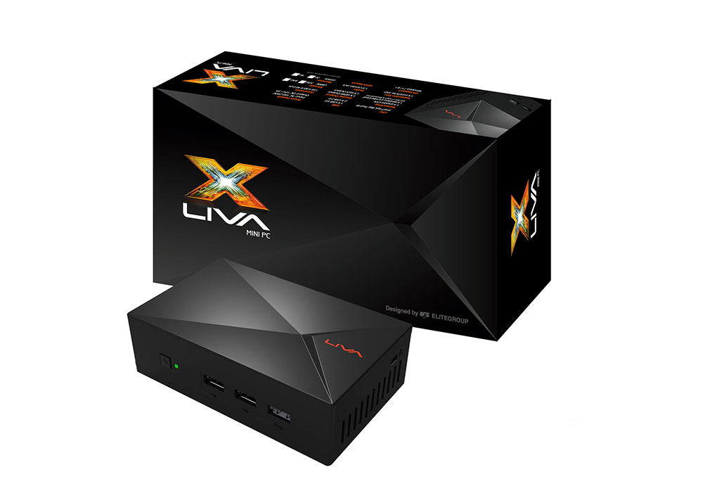

#gdkscoreviewer#
The Open Source Smart Podium

##Hardware##

Liva X Mini PC

##OS##
* Ubuntu 14.04 - for install help see (should work with 14.04 and 13.10): [http://www.intel.com/content/dam/www/public/us/en/documents/application-notes/atom-e38xx-n2xx-bay-trail-ubuntu-setup-app-note.pdf]

##Packages & Software##
* recommended: xinput_calibrator run 'sudo apt-get install xinput_calibrator'

Questions? Contact: 
* tylerlehrlich@gmail.com
* calebashmoreadams@gmail.com